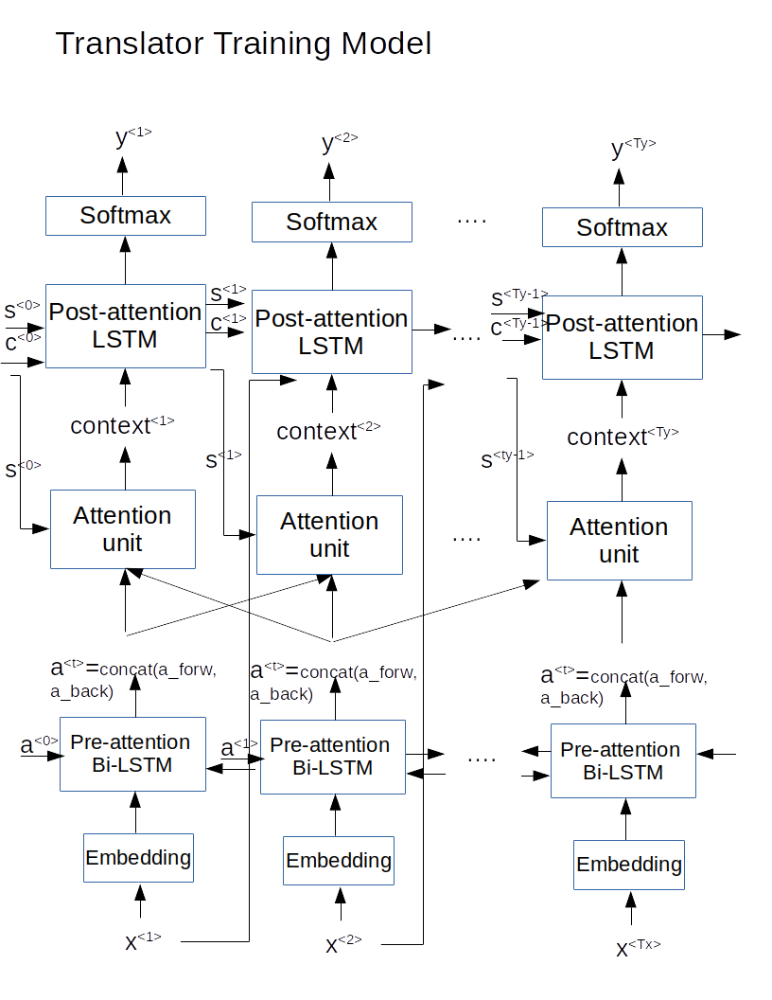
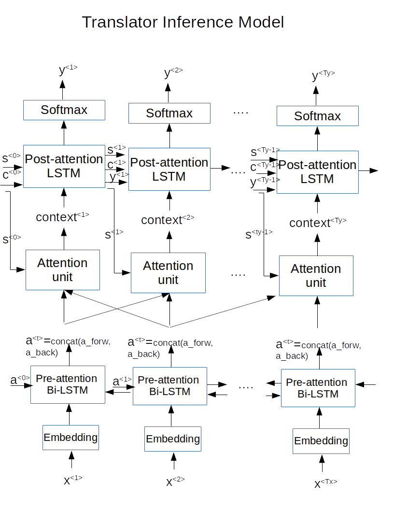

# Another NMT Keras Tutorial


Neural Machine Translation with attention mechanism implemented with some of tensorflow 2's newest feature such as overriding training step and test step function of Keras subclassed model.

Though Keras NMT with attention tutorial already shows how to implement a basic NMT model with attention with tensorflow, it would be interesting to try out some other new functionality comes out since tensorflow 2.2. since these model needs custom training and evaluating loop and it would be a good test case to implement these features.
By subclassing keras model and overriding train_step and test_step for customized training and inference loop
but still able to use the many features come with keras model, such as fit, evaluate,
metric, etc...


using the best practice suggested by tensorflow guide
i picked NMT because it is relatively complex that using functional API is ok but 
hard to maintain the code.  using the subclassing (objected oriented) approach produce much better result
Note that the __init__() method of the base Layer class takes some keyword arguments, in particular a name and a dtype. It's good practice to pass these arguments to the parent class in __init__() and to include them in the layer config:

Encoder, Decoder, and BahdanauAttention are all layers, and Translator is a model.
`
class Encoder(Layer):
`
`
class Decoder(Layer):
`
`
class BahdanauAttention(Layer):
`

By assigning Keras Layers' instance as attributes of other Layers, the weights of inner layer become trackable:
```
class Translator(tf.keras.Model):
    def __init__(self, vocab_inp_size, vocab_tar_size, embedding_dim, 
                 hidden_units_num, name="Translator", 
                 **kwargs):
      super(Translator, self).__init__(name=name, **kwargs)
      self.encoder = Encoder(vocab_inp_size, embedding_dim, hidden_units_num)
      self.decoder = Decoder(vocab_tar_size, embedding_dim, hidden_units_num)
```      
So Translator model is composed of Decoder and Encoder Layers, and Decoder Layer is composed of Embedding, LSTM, Dense, and BahdanauAttention.  By doing so, all the weights from all these layers are trackable, making accessing trainable weights very easy:
```
trainable_vars = self.trainable_variables    
gradients = tape.gradient(loss, trainable_vars)
``` 
In the original tutorial, the Encoder is a Keras Model instead of Layer, so Enocder's trainable_variables have to be manually included. 

Note: we lazily create layers' weights during layers' instantiation like Kera's best practice guide suggests.  Notice there is no input_shape specified in lstm __init__() or input_length in embedding init():

```
class Encoder(Layer):
  def __init__(self, vocab_size, embedding_dim, units, 
               name="Encoder", **kwargs):
    super(Encoder, self).__init__(**kwargs)
    self.units = units
    self.embedding = Embedding(vocab_size, embedding_dim)
    self.bi_LSTM_last = Bidirectional(LSTM(units, return_sequences=True, 
                                      return_state = True))
    self.bi_LSTM = Bidirectional(LSTM(units, return_sequences=True))
```
Other things you can do with an individual Keras Layer are customizing loss and metric, making it trainable or not etc.

For the loss function, you can either implement one like that in the original tutorial, or use the Keras' build-in loss functions passed in through model.compile():

`
loss = tf.keras.losses.SparseCategoricalCrossentropy(from_logits=True)
`

`
model.compile(optimizer=optimizer, loss=loss, metrics=metrics)
`

Also in the training loop, we can use the specified loss object and metrics objects from model.compile function inside train_step function because we are overriding train_step:
```
...
loss += self.compiled_loss(targ[:, t], predictions)
self.compiled_metrics.update_state(targ[:, t], predictions)
...
self.optimizer.apply_gradients(zip(gradients, trainable_vars))
...
```
Notice we pass from_logits=True to the loss function object for numerical stability.  We have to use linear activation function in the Dense layer in Decoder then.  The loss function object will take care of softmax function part.  See [this](https://stackoverflow.com/questions/52125924/why-does-sigmoid-crossentropy-of-keras-tensorflow-have-low-precision/52126567#52126567) for detail.

By subclassing Keras Model class and overriding train_step(), we can use model.fit() to train our model.  We can now take advantage of all the functionality that come with fit(), such as callbacks, batch and epoch handling, validation set metrics monitoring, and custom training loop logic etc.

`model.fit(dataset_train, epochs=EPOCHS, steps_per_epoch=steps_per_epoch, verbose=2, callbacks=[early_stopping], validation_data=dataset_valid)`

We are also able to provide different logic in back prop, which is in train_step() from in forward pass, which is inside model's call() function.
```
def train_step(self, data):
      inp, targ = data
      loss = 0
      with tf.GradientTape() as tape:
        enc_output, enc_hidden, enc_cell = self.encoder(inp)    
        dec_hidden = enc_hidden
        dec_cell = enc_cell
        dec_input = tf.expand_dims(targ[:,0], 1) 
        # Teacher forcing - feeding the target (ground truth) as the next decoder input
        for t in range(1, targ.shape[1]):
          # passing enc_output to the decoder. predictions shape == (batch_size, vocab_tar_size)
          predictions, dec_hidden, dec_cell, _ = self.decoder(dec_input, dec_hidden,
                                                         dec_cell, enc_output) #throws away attension weights
          #targ shape == (batch_size, ty)
          loss += self.compiled_loss(targ[:, t], predictions) #take parameters of ground truth and prediction
          # using teacher forcing
          dec_input = tf.expand_dims(targ[:, t], 1)  # targ[:, t] is y
          self.compiled_metrics.update_state(targ[:, t], predictions)

      trainable_vars = self.trainable_variables    
      gradients = tape.gradient(loss, trainable_vars)    
      # Update weights
      self.optimizer.apply_gradients(zip(gradients, trainable_vars))
      # Return a dict mapping metric names to current value
      return {**{'loss': loss}, **{m.name: m.result() for m in self.metrics}}
```
Here, teacher's force is used, just like the original Keras tutorial, where ground truth at time step t is extracted and feed in as decoder's input.
```
def forward_pass(self, inp, targ):   
      enc_output, enc_hidden, enc_cell = self.encoder(inp) #inp shape (batch_size, Tx)
      dec_hidden = enc_hidden # (batch_size,dec_units)  #if encoder and decoder hidden units # diff, need to initialize dec_hidden accordingly
      dec_cell = enc_cell
      Ty = targ.shape[1]
      dec_input = tf.expand_dims(targ[:,0], 1) 
      y_pred = tf.TensorArray(tf.float32, size=Ty)
      for t in range(Ty):   #targ.shape[1] is Ty
        # passing enc_output to the decoder. prediction shape == (batch_size, vocab_tar_size)
        predictions, dec_hidden, dec_cell, _ = self.decoder(dec_input, dec_hidden, 
                                                       dec_cell, enc_output) #throws away attension weights
        predicted_id = tf.math.argmax(predictions, axis=-1) #predicted_id shape == (batch_size,)
        #y_pred.append(predictions) #(Ty, batch_size)
        y_pred = y_pred.write(t, predictions)
        dec_input = tf.expand_dims(predicted_id, 1)
        self.compiled_loss(targ[:, t], predictions, regularization_losses=self.losses)
        self.compiled_metrics.update_state(targ[:, t], predictions)
      y_pred = tf.transpose(y_pred.stack(), [1, 0, 2])
      return y_pred
```
Here in the forward pass, at each time step, y_pred is appended to TensorArray.  Then at the end the prediction tensor is transposed so that first dimension is batch size, second is timestep.  greedy sampling method is used here, where max is applied on the probability distribution and converted to word index.  Beam search can be implemented here.
Again TensorArray is used here instead of python list to avoid potential python side effects as suggested by tensorflow guide as best practice.

We can also override test_step() to provide custom evaluation logic, so we can use model.evaluate() with all the functionality it brings to monitor the loss and metrics on validation set. 
```
def test_step(self, data):
        # Unpack the data
        x, y = data
        # Compute predictions
        y_pred = self(data, training=False)

        # Note that it will include the loss (tracked in self.metrics).
        return {m.name: m.result() for m in self.metrics}
```
Inside the function it simply calls model's call() function which just invokes forward pass logic that records loss and metrics.


## What each file does: 
 * trainer6/BahdanauAttention.py: Define attention layer.  Uses "add" attention mechanism. 
 * trainer6/Decoder.py: Define decoder layer, which contains a single LSTM layer.
 * trainer6/Encoder.py: Define encoder layer, which contains a single Bi-LSTM layer.
 * trainer6/model.py: Get input and target tokenizers, max length of input and target language sentences from the "full" dataset file, and read in training data from training file and validation data from validation file and does the training.
 * trainer6/task.py: Parse the commad arguments.
 * trainer6/Translator.py: Define the Translator model, which contains reference to encoder and decoder layers.  Also contains the overriden train_step and test_step functions and translate function, which is just prediction on a single example.
 * trainer6/util.py: All the utility functions and classes used by model.py and eval6.py.  Many from the Keras NMT tutorial.
 * config.yaml: For Google cloud use. See train-gcp.sh.
 * deu.txt: Raw translation input file.  See prepare_input_files.py.
 * english-german-x.csv: x represent the number of examples in "full" dataset file. Contains tab seperated language pairs examples.  Created by prepare_input_files.py

 * english-german-test-x.csv: Language pairs examples for testing.
 * english-german-train-x.csv: Language pairs examples for training.
 * english-german-valid-x.csv: Language pairs examples for validation.
 * eval6.py: Get input and target tokenizers, max length of input and target language sentences from the "full" dataset file, and read in training data from training file and validation data from validation file and does the evaluation in metrics from model.compile and in BLEU scores.
 * prepare_input_files.py: process sentences pair in deu.txt and converts it to english-german-x.csv.  Also split the "full" dataset file into training, test, and validation dataset files.  The ratio can be changed.
 * train-gcp.sh: A shell script submitting training job to AI platform service from Google Cloud.  Modify the config.yaml to configure the cloud server instance. 
 * train-local6.sh: Run the training job locally through gcloud.  Google cloud sdk required.

## Usage

### Preparing Raw Input Files
 1) Download the input file here at [Language dataset source: www.ManyThings.org](http://www.manythings.org/anki/) and unzip to deu.txt. It looks like this:
 ```
 ...
She is kind.	Sie ist liebenswürdig.
She woke up.	Sie wachte auf.
She's a dog.	Sie hat einen Hund.
She's happy.	Sie ist glücklich.
Show him in.	Bring ihn herein.
Show him in.	Bringen Sie ihn herein.
Sit with me.	Setz dich zu mir!
Stand aside.	Geh zur Seite!
Stand aside.	Gehen Sie zur Seite!
...
```

 2) Put deu.txt in the same directory as  prepare_input_files.py and execute it.  It produces 4 files, a full, a training , a test and a validation dataset file:
 
   ``
 python prepare_input_files.py
 ``
```
Saved: english-german-180000.csv
[Hi.] => [Hallo!]
[Hi.] => [Grüß Gott!]
[Run!] => [Lauf!]
[Wow!] => [Potzdonner!]
[Wow!] => [Donnerwetter!]
[Fire!] => [Feuer!]
[Help!] => [Hilfe!]
[Help!] => [Zu Hülf!]
[Stop!] => [Stopp!]
[Wait!] => [Warte!]
Saved: english-german-train-180000.csv
Saved: english-german-test-180000.csv
Saved: english-german-valid-180000.csv
```
Note: you can change how many examples you'd like to have and the ratio between training and testing/validation in prepare_input_files.py.


### Training
 1) Train locally: 
 
 ``
 ./train-local6.sh
 ``
    Note: change parameters in train-local6.sh such as example_limit, batch size, epoch, etc.  example_limit is the total example size in the full dataset file, which is the sum of size of training, testing and validation set.
 2) Train on Google Cloud Platform:
 
 ``
 ./train-gcp.sh
 ``

### Evaluating

 ``
python3 eval6.py
  ``
 example_limit needs to match the size of full dataset file.
 
### Translating
 
 Just use model.translate() to implement translating.
 
 

<!--<div align="left">-->
  <!--<br><br><br><br>-->
<!--</div>-->

## Model Diagram




## References

 * [How to Develop a Neural Machine Translation System from Scratch by Jason Brownlee](https://machinelearningmastery.com/develop-neural-machine-translation-system-keras/) 
 
 * [Language dataset source: www.ManyThings.org](http://www.manythings.org/anki/) 

 * Tensorflow tutorial on NMT with attention
 

